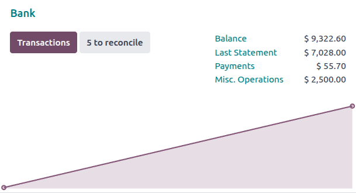
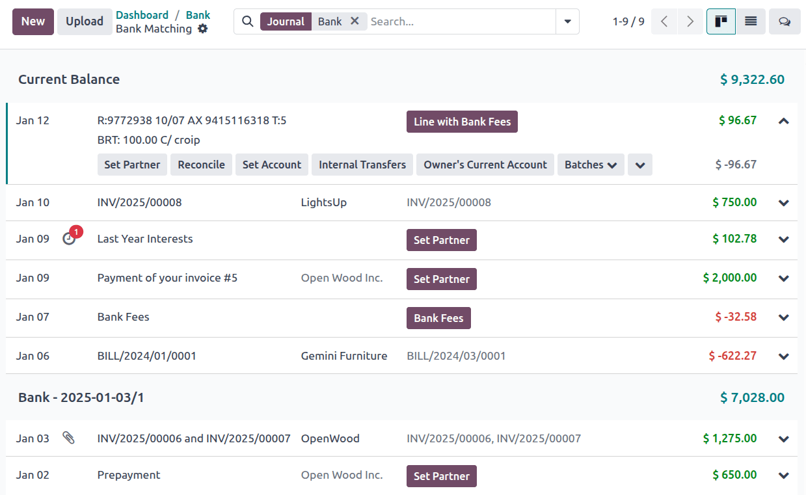

===================
Bank reconciliation
===================

**Bank reconciliation** is the process of matching your :doc:`bank transactions <transactions>` with
your business records, such as :doc:`customer invoices <../customer_invoices>`, :doc:`vendor bills
<../vendor_bills>`, and :doc:`payments <../payments>`. Not only is this compulsory for most
businesses, but it also offers several benefits, such as reduced risk of errors in financial
reports, detection of fraudulent activities, and improved cash flow management.

Thanks to the :ref:`default matching rules <accounting/reconciliation/reconcile>` and customizable
bank :doc:`reconciliation models <reconciliation_models>`, Odoo selects the matching items
automatically when possible.

.. seealso::
   - `Odoo Tutorials: Bank reconciliation
     <https://www.odoo.com/slides/slide/bank-reconciliation-2724>`_
   - :doc:`bank_synchronization`
   - :doc:`transactions`

.. _accounting/reconciliation/access:

Bank reconciliation view
========================

To access a bank journal's **reconciliation view**, go to your :guilabel:`Accounting Dashboard` and
either:

- click the journal name (e.g., :guilabel:`Bank`) or its :guilabel:`Transactions` button to display
  all transactions, including those previously reconciled, or
- click the :guilabel:`X to Reconcile` button to display only unreconciled transactions. To include
  previously reconciled transactions, remove the :guilabel:`Not Matched` filter from the search bar.

The bank reconciliation view is composed of lines for each transaction of the journal with the
newest displayed first. Each transaction has a date, a label, a partner (if set), :ref:`action
buttons <accounting/reconciliation/action-buttons>` that execute different actions, and the
transaction amount. Each line can be expanded to show additional information.

.. _accounting/reconciliation/transactions:

Transactions
------------

Every :doc:`transaction <transactions>` is linked to a journal entry that hits the journal's main
account and its suspense account until it is fully reconciled, at which point the suspense account
is replaced.

.. _accounting/reconciliation/action-buttons:

Possible action buttons
~~~~~~~~~~~~~~~~~~~~~~~

Up to two suggested action buttons are available as primary buttons, but all available action
buttons are displayed when the transaction is expanded. The following action buttons are available
depending on the details of the transaction:

- :guilabel:`Set Partner`: Open a search view to add a partner to the transaction.
- :guilabel:`Set Account`: Open a search view to manually select an account and add a counterpart
  entry line for the full amount of the transaction with this account. If necessary, :ref:`edit the
  line <accounting/reconciliation/edit>` to change the amount.
- :guilabel:`Receivable`: Add a counterpart entry line with the receivable account of the partner.
- :guilabel:`Sales`: Open a list view of sales orders belonging to the transaction's
  :guilabel:`Partner` (or proceed directly to the form view if only one relevant sales order
  exists). Select the relevant invoice(s) and click :guilabel:`Create Invoices`, then return to the
  bank reconciliation view and match the invoice(s) using the :guilabel:`Reconcile` action button.
- :guilabel:`Payable`: Add a counterpart entry line with the payable account of the partner.
- :guilabel:`Reconcile`: Open a search view of existing items such as customer invoices, vendor
  bills, and payments. Select one or multiple items to add counterpart entry lines with the
  corresponding accounts of those items.
- :guilabel:`Batches`: Open a short list of batch payments. To view all batch payments, click
  :guilabel:`Search More ...`. Select a batch payment to add a counterpart entry line for each
  payment of the batch with the corresponding account of each payment.
- :doc:`reconciliation_models`: Each manual reconciliation model that could apply to the transaction
  is displayed. Click the reconciliation model's action button to generate the counterpart entries
  defined on the reconciliation model.

.. note::
   To remove the partner from a transaction, click the :icon:`fa-times` :guilabel:`(close)` icon
   next to the partner's name.

Click the :icon:`fa-chevron-down` :guilabel:`(chevron down)` icon to display any of the above action
buttons that are hidden due to space limitations, as well as the following:

- :guilabel:`Upload bills`: Upload one or more bills to be :doc:`digitized
  <../vendor_bills/invoice_digitization>`. After digitization, the bills are available for matching
  via the :guilabel:`Reconcile` action button.
- :guilabel:`Manage Models`: Open the list view of :doc:`reconciliation_models`.
- :guilabel:`Open Journal Entry`: Open the journal entry of this transaction.
- :guilabel:`Delete Transaction`: Delete this transaction.

.. note::
   Uploading bills from the reconciliation view does not automatically reconcile them with the
   active transaction.

.. seealso::
   :doc:`../../../essentials/in_app_purchase`

.. _accounting/reconciliation/reconcile:

Reconcile transactions
======================

When possible, Odoo automatically reconciles transactions based on their fields.

If no partner is set on the transaction, the transaction :guilabel:`Label` is compared with the
:guilabel:`Number`, :guilabel:`Customer Reference`, :guilabel:`Bill Reference`, and
:guilabel:`Payment Reference` of existing invoices, bills, and payments.

If a partner is set on the transaction, the transaction is instead matched with invoices, bills, and
payments of the partner based on the :guilabel:`Amount` according to these rules:

- Exact match
- Discounted match - for payment terms with discounts for early payments
- Tolerance match - within 3% to account for merchant fees, rounding differences, and user errors
- Currency match - when the transaction is in a different currency than the invoice, bill, or
  payment (with a 3% tolerance for exchange rate differences)
- Amount in label - if the invoice :guilabel:`Amount` is found in the transaction's
  :guilabel:`Label`

.. note::
   All of these fixed rules apply in the specified order. As soon as a match is found, the search
   ends.

In addition to using these fixed matching rules, transactions can be matched automatically with the
use of :doc:`reconciliation models <reconciliation_models>`. Otherwise, reconcile transactions
manually by following these steps:

#. Select a transaction among unmatched bank transactions.
#. Define the counterpart. There are several options for defining a counterpart, including
   :ref:`matching existing entries <accounting/reconciliation/existing-entries>`, :ref:`manually
   setting the account <accounting/reconciliation/set-account>`, matching with :doc:`batch payments
   <../payments/batch>`, and using :ref:`reconciliation model buttons
   <accounting/reconciliation/button>`.
#. If the resulting entry is not fully balanced, add another existing counterpart entry or write it
   off by :ref:`setting the account <accounting/reconciliation/set-account>` of the remaining
   amount.

.. _accounting/reconciliation/existing-entries:

Existing entries
----------------

To reconcile transactions with existing items such as customer invoices, vendor bills, and
payments, click the :guilabel:`Reconcile` action button to open a list view of journal items to
match. If the :guilabel:`Partner` is set, this list is automatically filtered to only include items
related to that partner.

.. tip::
   The search bar within the :guilabel:`Search: Journal Items to Match` window allows you to search
   for specific journal items.

.. _accounting/reconciliation/set-account:

Set account
-----------

If there is not an existing entry to match the selected transaction, you can still reconcile the
transaction manually. Click :guilabel:`Set Account`, then choose the correct account. If only part
of the transaction should be written off instead of the full amount, :ref:`edit the line
<accounting/reconciliation/edit>` to the correct amount and reconcile the remaining amount as
desired.

.. tip::
   If the partner is set, write the amount off to their receivable or payable account directly by
   clicking the :guilabel:`Receivable` or :guilabel:`Payable` action button.

.. _accounting/reconciliation/button:

Reconciliation models
---------------------

Use a :doc:`reconciliation model <reconciliation_models>` for manual operations that are frequently
repeated. These custom buttons allow you to quickly reconcile bank transactions manually and can
also be used in combination with existing entries.

.. _accounting/reconciliation/edit:

Edit lines and unreconcile transactions
=======================================

To edit a counterpart entry line, click on the :icon:`fa-pencil` :guilabel:`(pencil)` icon, then
edit the necessary fields in :guilabel:`Edit Line` window.

.. note::
   When the counterpart entry line is an existing journal item, some fields are read-only.

To unreconcile a transaction, delete all counterpart entry lines associated with the transaction by
clicking on the :icon:`fa-trash` :guilabel:`(trash)` icon.

.. _accounting/reconciliation/netting:

Netting
=======

Netting (also known as AP/AR offsetting) is the process of balancing incoming debts from and
outgoing debts to the same partner. Two main scenarios exist:

- :ref:`A bank transaction balances <accounting/reconciliation/net-transaction>` (either fully or
  partially) the incoming and outgoing debts.
- :ref:`No bank transaction balances <accounting/reconciliation/net-no-transaction>` the incoming
  and outgoing debts. This situation can occur either when the debts balance each other completely
  or when the debts remain unbalanced.

.. example::
   One common application of this workflow is when a vendor owes its customer a commission or
   rebate. For example, a company receives a vendor bill for €1000, but they get a 5% rebate. The
   company can create a customer invoice for €50 to reconcile with the vendor bill, leaving €950
   due on the vendor bill.

.. _accounting/reconciliation/net-transaction:

Netting with bank transactions
------------------------------

When a bank transaction balances (either fully or partially) the incoming and outgoing debts,
reconcile the bank transaction from the bank reconciliation view like any other :ref:`existing
entries <accounting/reconciliation/existing-entries>`:

#. Click :guilabel:`Reconcile` on the transaction.
#. Select all the relevant journal items on both the payable and receivable side.
#. Click :guilabel:`Select`.
#. If a balance remains, depending on the details, the following situations are possible:

   - An invoice, bill, or other item is not fully reconciled, and the remaining balance can be
     applied to other bank transactions.
   - The bank transaction itself is not fully reconciled, and the remaining balance can be
     :ref:`reconciled <accounting/reconciliation/reconcile>` as in any other situation.

.. _accounting/reconciliation/net-no-transaction:

Netting without bank transactions
---------------------------------

When no bank transaction balances the incoming and outgoing debts, there is nothing to reconcile
from the bank reconciliation view. However, the debt amount is visible in both the account receivable
and the account payable. To balance these debts so that they no longer appear on the partner ledger,
follow these steps:

#. Go to :menuselection:`Accounting --> Accounting --> Journal Items`.
#. Select the journal items that hit the account receivable and account payable and represent the
   the debts to be netted.
#. Click :guilabel:`Reconcile`.
#. If the debts don't balance each other perfectly, a :guilabel:`Write-Off Entry` pop up window
   appears, allowing you to decide how to resolve the remaining balance:

   - Select :guilabel:`Allow partials` to only partially reconcile the account receivable and
     account payable and leave the remaining balance open.
   - Use a reconciliation model button to write off the balance.
   - Manually choose an :guilabel:`Account`, and optionally adjust the :guilabel:`Tax`,
     :guilabel:`Journal`, :guilabel:`Label`, :guilabel:`Date`, and :guilabel:`To Check` fields.

The items are now matched, and their balance is removed from the partner ledger, representing that
no payment is due for these debts.

.. tip::
   Filter by the partner and/or amount to more easily find the relevant transactions.

.. note::
   The workflow is the same whether there are only two equal debts in the receivable and payable
   accounts or multiple debts in each account.
