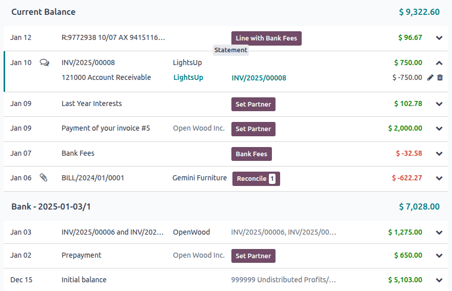

============
Transactions
============

Importing transactions from your bank statements allows keeping track of bank account transactions
and reconciling them with the ones recorded in your accounting.

:doc:`Bank synchronization <bank_synchronization>` automates the process. However, if you do not
want to use it or if your bank is not yet supported, other options exist:

- :ref:`Import bank transactions <accounting/transactions/import>` delivered by your bank;
- :ref:`Register bank transactions <accounting/transactions/register>` manually.

.. note::
   :ref:`Grouping transactions by statement <accounting/transactions/statements>` is optional.

.. _accounting/transactions/view:

Transaction view
================

Unreconciled transactions display the following information while collapsed:

- The date of the transaction
- A button linked to the chatter. The icon of this button can vary:

  - The :icon:`fa-comments-o` :guilabel:`(comments)` icon displays only on hover and indicates that
    there is nothing to declare.
  - The :icon:`fa-paperclip` :guilabel:`(attachments)` icon indicates that there is an attachment on
    the journal entry.
  - The :icon:`fa-clock-o` :guilabel:`(activities)` icon indicates that there is an activity
    scheduled on the journal entry.

- The label of the transaction
- The partner of the transaction (if one is set)
- Up to two :ref:`action buttons <accounting/reconciliation/action-buttons>`, depending on the
  details of the transaction
- The balance of the transaction

.. note::
   - When the chatter of a transaction is open, the active transaction has a blue tag to indicate
     which transaction's chatter is being displayed.
   - The chatter can be opened and closed by clicking the :icon:`fa-comments-o`
     :guilabel:`(comments)` icon and the :icon:`fa-times` :guilabel:`(close)` icon in the top right
     of the view.
   - Once a transaction is :doc:`reconciled <reconciliation>`, its action buttons are replaced with
     the labels of the item(s) it was reconciled with or the account if it was reconciled with the
     :guilabel:`Set Account` action button.

.. _accounting/transactions/import:

Import transactions
===================

Odoo supports multiple file formats to import transactions:

- SEPA recommended Cash Management format (CAMT.053)
- Comma-separated values (CSV)
- Excel (XLSX)
- Open Financial Exchange (OFX)
- Quicken Interchange Format (QIF)
- Belgium: Coded Statement of Account (CODA)

To import a file, go to the :guilabel:`Accounting Dashboard`, click the :icon:`fa-ellipsis-v`
:guilabel:`(ellipsis)` icon on the :guilabel:`Bank` journal, and select :guilabel:`Import file`.
Next, select the file and upload it.

.. tip::
   Alternatively, access the transaction list by:
    - clicking on the :guilabel:`Bank` journal, then clicking :guilabel:`Upload`
    - dragging and dropping a file on the bank journal on the :guilabel:`Accounting Dashboard`
    - dragging and dropping a file on the transaction reconciliation (kanban) view

Certain file types such as CSV and XLSX, then require setting the necessary formatting options and
mapping the file columns with their related Odoo fields, after which you can run a :guilabel:`Test`
and :guilabel:`Import` your bank transactions. Other file types are mapped automatically.

.. seealso::
   :doc:`/applications/essentials/export_import_data`

.. _accounting/transactions/register:

Register bank transactions manually
===================================

You can also record your bank transactions manually. To do so, go to the :guilabel:`Accounting
Dashboard`, click on the :guilabel:`Bank` journal, and then on :guilabel:`New`. The
:guilabel:`Partner` field is optional to ease the reconciliation process, but the :guilabel:`Label`
and :guilabel:`Date` fields are mandatory.

.. _accounting/transactions/statements:

Statements
==========

A **bank statement** is a document provided by a bank or financial institution that lists the
transactions that have occurred in a particular bank account over a specified period of time.

In Odoo Accounting, it is optional to group transactions by their related statement, but depending
on your business flow, you may want to record them for control purposes.

.. important::
   If you want to compare the ending balances of your bank statements with the ending balances of
   your financial records, *don't forget to create an opening transaction* to record the bank
   account balance as of the date you begin synchronizing or importing transactions. This is
   necessary to ensure the accuracy of your accounting.

To access a list of existing statements, go to the :guilabel:`Accounting Dashboard`, click the
:icon:`fa-ellipsis-v` :guilabel:`(ellipsis)` icon next to the bank or cash journal you want to
check, then click :guilabel:`Statements`.

.. _accounting/transactions/statement-kanban:

Statement creation
------------------

The bank reconciliation view is divided into groups of statements containing different
transactions. To create a statement, hover on the most recent transaction that should be included in
the statement, and click the :guilabel:`Statement` button that appears on the upper separator line.
Doing so creates a statement from that transaction down to the oldest transaction that is not yet
part of a statement.

In the :guilabel:`Create Statement` window, fill out the statement's :guilabel:`Reference`, verify
its :guilabel:`Starting Balance` and :guilabel:`Ending Balance`, add an attachment such as a PDF
of the statement if desired, and click :guilabel:`Save`.

.. tip::
   Transactions can also be added to statements from the list view. Select all the transactions
   corresponding to the bank statement, and, in the :guilabel:`Statement` column, select an existing
   statement or create a new one by typing its reference, clicking on :guilabel:`Create and
   edit...`, filling out the statement's details, and saving.

.. _accounting/transactions/view-edit-print:

Statement viewing, editing, and printing
----------------------------------------

To view an existing statement, click on the statement amount in the reconciliation (kanban) view or
click on the statement name and then the :icon:`fa-arrow-right` :guilabel:`(Internal link)` icon in
the bank transaction list view. From here, you can edit the :guilabel:`Reference`,
:guilabel:`Starting Balance`, :guilabel:`Ending Balance`, and :guilabel:`Attachments`.

.. note::
   Manually updating the :guilabel:`Starting Balance` automatically updates the :guilabel:`Ending
   Balance` based on the new value of the :guilabel:`Starting Balance` and the value of the
   statement's transactions.

.. warning::
   If the :guilabel:`Starting Balance` doesn't equal the previous statement's :guilabel:`Ending
   Balance`, or if the :guilabel:`Ending Balance` doesn't equal the running balance
   (:guilabel:`Starting Balance` plus the statement's transactions), a warning appears explaining
   the issue. To maintain flexibility, it is still possible to save without first resolving the
   issue.

To generate and print a PDF of the bank statement, click on the :icon:`fa-cog` :guilabel:`(gear)`
icon and click :icon:`fa-print` :guilabel:`Statement`.

.. note::
   When a bank statement is generated to be printed, it is automatically added to the
   :guilabel:`Attachments` if no file was attached when creating the statement.
